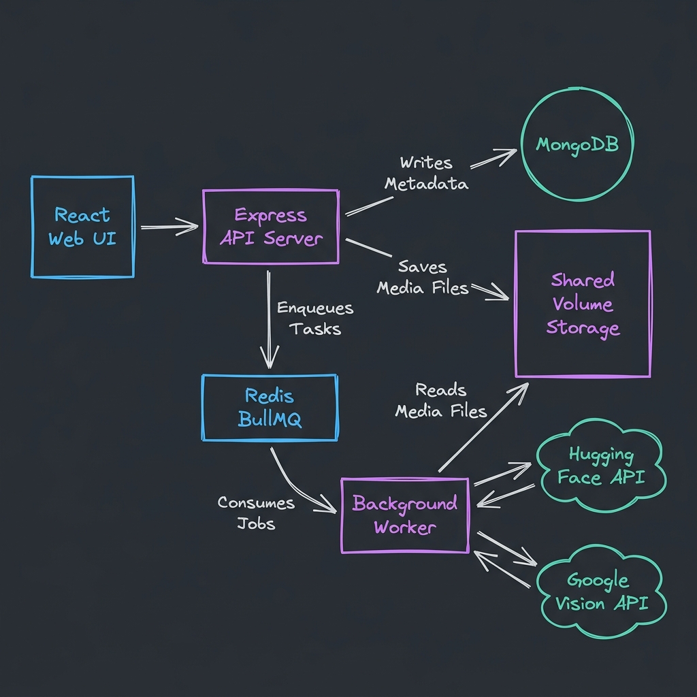

## System Architecture



## Quick Start (Local Run)

You can spin up the entire multi-service application with Docker Compose.

### 1. Set environment variables (Optional)
Create an `.env` file in the root directory (or server directory) if you want to use live AI API connections:
```env
# Hugging Face Inference API Token
HF_API_TOKEN=your_hugging_face_token_here

# Google Cloud Vision REST API Key
GOOGLE_API_KEY=your_google_cloud_vision_api_key_here
```

### 2. Launch Services
Run the following command in the root folder:
docker-compose up --build

## API Endpoints Summary

For the full detailed documentation, check the [api-spec.yaml](file:///c:/Users/parth/Desktop/Camarin%20AI%20Task/api-spec.yaml) file.

- **Authentication**:
  - `POST /api/auth/register`: Signup new account.
  - `POST /api/auth/login`: Signin and get JWT token.
- **Media Jobs**:
  - `POST /api/jobs/upload`: Upload image (multipart/form-data, key: `image`). Returns `jobId` immediately.
  - `GET /api/jobs`: List user's jobs sorted by date.
  - `GET /api/jobs/:id`: Fetch specific job details and results.
  - `POST /api/jobs/:id/retry`: Re-enqueue a failed job back to the BullMQ.

---

## Scaling to 10x Load (Discussion)

If the system experiences a 10x increase in load (e.g. 100+ images per second), we would see bottlenecks in disk space, CPU (for image resizing), and API rate limits. Here is how we would scale:

1. **Decouple Storage (Cloud Object Storage)**:
   - *Problem*: Shared local Docker volumes do not scale across multiple node hosts (e.g. in Kubernetes).
   - *Solution*: Swap the local disk storage with AWS S3, Google Cloud Storage, or Cloudflare R2. The API server uploads files directly to S3 and enqueues the S3 URL. The worker downloads files directly from the S3 URL, removing stateful disk dependencies.

2. **Horizontal Worker Scaling**:
   - *Problem*: AI API calls block worker slots, causing the queue to build up.
   - *Solution*: Scale the number of worker containers. Since BullMQ operates in a stateless manner with Redis coordinates, adding 10 more worker instances will distribute jobs evenly without race conditions. We can implement Autoscaling (KPA/HPA) based on queue size or queue delay metrics.

3. **Rate Limiting & Token Buckets**:
   - *Problem*: External APIs (Hugging Face / Google Vision) have rate limits and will start rejecting requests.
   - *Solution*: Configure BullMQ with rate limit limits per queue (e.g., `limiter: { max: 50, duration: 1000 }`) to regulate processing speed. Keep the images in the Redis queue and process them steadily without overwhelming external API quotas.

4. **Image Pre-processing at Edge / API**:
   - *Problem*: Transmitting large 5MB files to AI models consumes excessive bandwidth and slows processing.
   - *Solution*: Resize and compress images (e.g., limit dimensions to 1024x1024) at the API layer using a package like `sharp` before writing to storage, reducing payload sizes for the AI APIs by up to 90%.
